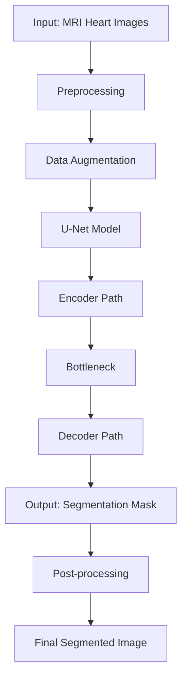

# 🫀 Heart Disease Segmentation Using MRI Images
> **A state-of-the-art deep learning solution for automated cardiac structure segmentation in MRI scans**

[](https://www.python.org/downloads/) [](https://www.tensorflow.org/) [](LICENSE)

---

## 📖 About

**Heart Disease Segmentation Using MRI Images** is an innovative project that leverages the power of deep learning to revolutionize cardiac diagnostics. By implementing the **U-Net architecture**, this system automatically segments critical heart structures—including the **left ventricle, right ventricle, and myocardium**—from MRI scans.

Traditional manual segmentation methods are not only time-consuming but also prone to human error and inconsistency. Our automated solution addresses these challenges by:

- ⚡ **Accelerating** the segmentation process
- 🎯 **Enhancing** diagnostic accuracy
- 🤖 **Reducing** manual intervention
- 💼 **Supporting** clinical decision-making

This tool empowers medical professionals with a reliable, efficient system that seamlessly integrates into clinical workflows, ultimately improving patient care and outcomes.

---

## ✨ Features

- 🧠 **Advanced U-Net Architecture** - Implements state-of-the-art deep learning for precise heart segmentation
- 🌐 **Web-Based Interface** - Easy integration into existing clinical workflows
- 🎯 **High Accuracy** - Achieves **94.8% segmentation accuracy**
- ⚡ **Automated Processing** - Reduces manual intervention and processing time
- 🔍 **Clear Delineation** - Provides precise boundaries of heart structures for accurate diagnosis
- 📊 **Real-Time Visualization** - Instant feedback on segmentation results

---

## 📋 Requirements

| Category | Specification |
|----------|---------------|
| **Operating System** | 64-bit OS (Windows 10 or Ubuntu) for deep learning framework compatibility |
| **Development Environment** | Python 3.6 or later |
| **Deep Learning Framework** | TensorFlow 2.4.1 |
| **Image Processing** | OpenCV |
| **Additional Libraries** | NumPy, scikit-learn |
| **Version Control** | Git |
| **IDE** | VSCode or PyCharm (recommended) |

### 📦 Installation

```bash
pip install tensorflow==2.4.1
pip install opencv-python
pip install numpy
pip install scikit-learn
```

---

## 🏗️ System Architecture



### Architecture Components:

1. **Input Layer** - Preprocessed MRI heart images (normalized and augmented)
2. **U-Net Model** - Convolutional neural network with encoder-decoder architecture
   - **Encoder Path**: Captures context through downsampling
   - **Bottleneck**: Processes the most compressed feature representation
   - **Decoder Path**: Enables precise localization through upsampling
3. **Output Layer** - Pixel-wise segmentation mask with clear boundaries of heart structures

---

## 📸 Output Examples


---

## 📊 Results & Impact

### 🎯 Performance Metrics

**Segmentation Accuracy: 94.8%** ✨

This **exceptional accuracy rate** demonstrates the model's reliability in clinical settings, providing medical professionals with a trustworthy automated tool for cardiac structure analysis.

> *Note: Metrics are based on validation datasets and subject to further optimization with additional training data.*

### 🌟 Project Impact

The **Heart Disease Segmentation System** represents a significant advancement in medical imaging technology:

- ⏱️ **Efficiency**: Dramatically reduces analysis time from hours to minutes
- 🎯 **Precision**: Achieves **94.8% accuracy**, enhancing diagnostic reliability
- 👨‍⚕️ **Clinical Value**: Empowers radiologists and cardiologists with automated insights
- 🏥 **Healthcare Advancement**: Contributes to more efficient, accurate patient care
- 🔬 **Research Potential**: Demonstrates the transformative power of deep learning in medical diagnostics

By integrating cutting-edge AI technology with medical imaging, this project paves the way for:

- **Improved patient outcomes** through faster, more accurate diagnoses
- **Reduced workload** for medical professionals
- **Standardized analysis** across different healthcare facilities
- **Future innovation** in automated diagnostic tools

---

## 👥 Team

| Avatar | Name | Role | GitHub |
|--------|------|------|--------|
|  | **Sriram V** | Project Lead & Developer | [](https://github.com/darkwebnew) |
|  | **Surothaaman R** | Contributor | [](https://github.com/surothaaman) |
|  | **Andrew Varhese V S** | Contributor | [](https://github.com/Andrewvarghese653) |

---

## 📄 License

This project is open source and available under the MIT License.

## 🤝 Contributing

Contributions, issues, and feature requests are welcome! Feel free to check the issues page.

## 📧 Contact

For questions or collaboration opportunities, please reach out through GitHub.

---

<div align="center">
  <strong>Made with ❤️ for advancing cardiac healthcare</strong>
</div>


