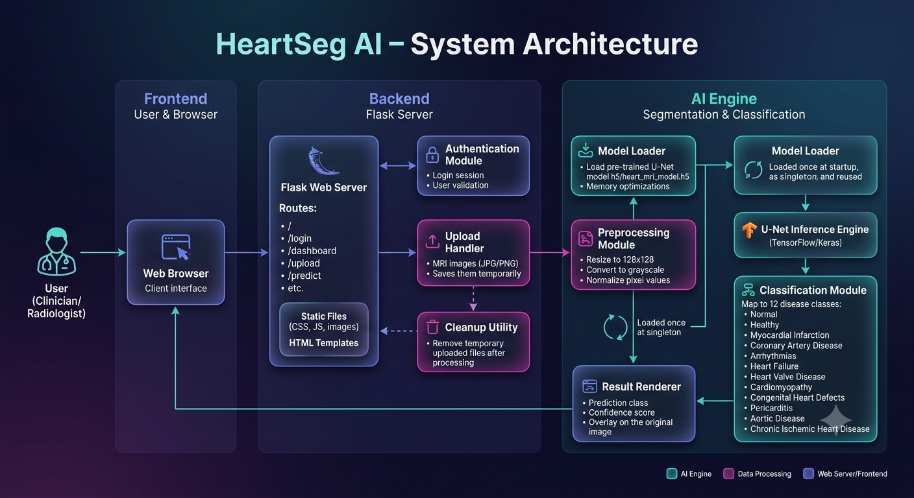
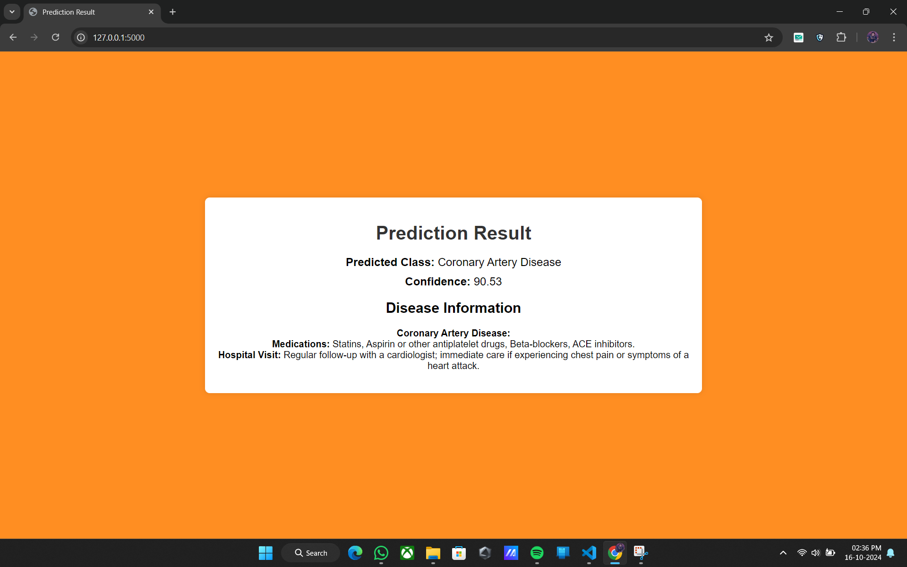
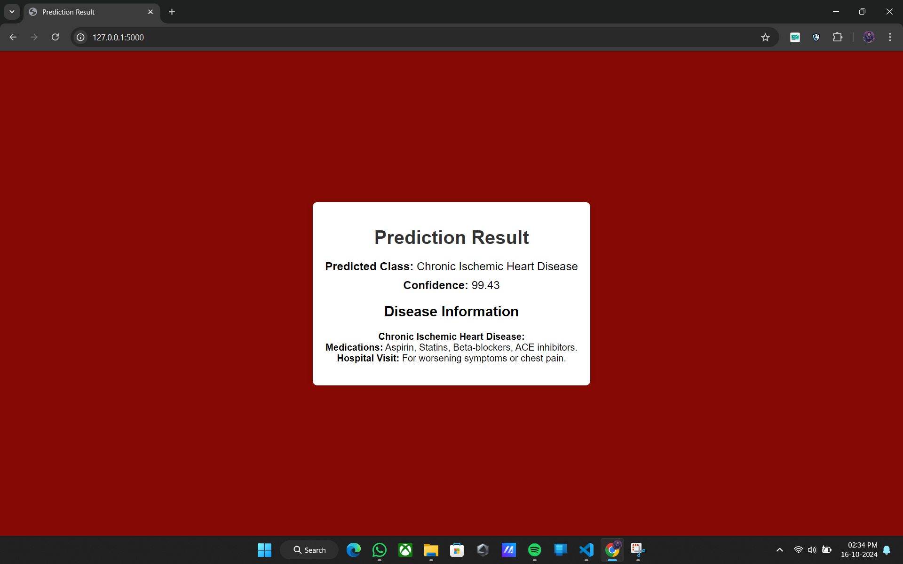
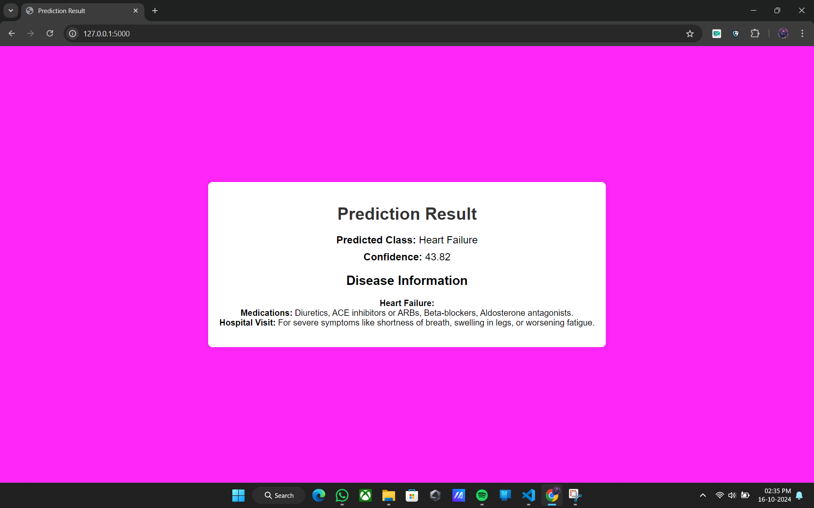
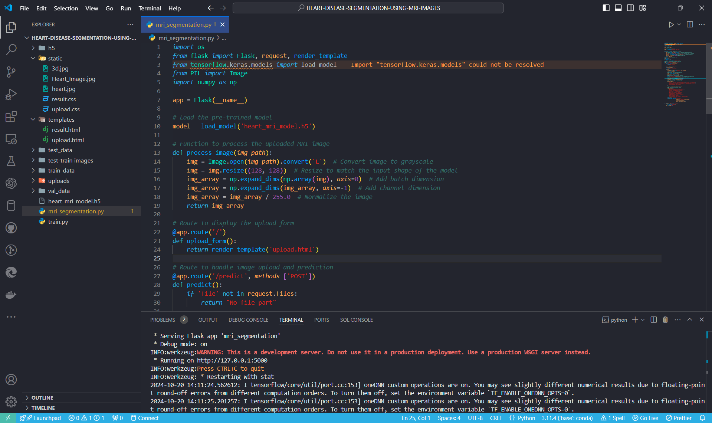

<div align="center">


[](https://git.io/typing-svg)

<br/>

[](https://www.python.org/)
[](https://www.tensorflow.org/)
[]()
[](https://opencv.org/)
[](https://numpy.org/)

<br/>

[]()
[]()
[](LICENSE.txt)
[]()

<br/>

> **🫀 Automated cardiac MRI segmentation — U-Net precisely delineates Left Ventricle, Right Ventricle & Myocardium with 94.8% accuracy, empowering faster and more reliable clinical diagnostics.**

<br/>

> **⚕️ Medical Disclaimer:** This system is an AI-assisted screening tool designed to **support** qualified medical professionals. All predictions require review by a licensed cardiologist before any clinical decision is made.

<br/>

[🚀 Quick Start](#-installation--quick-start) &nbsp;•&nbsp; [🏗️ Architecture](#%EF%B8%8F-system-architecture) &nbsp;•&nbsp; [📸 Screenshots](#-screenshots) &nbsp;•&nbsp; [📊 Results](#-results--performance) &nbsp;•&nbsp; [👥 Team](#-team) &nbsp;•&nbsp; [☕ Support](#-support-the-project)

</div>

---

<div align="center">

## 🏆 Why HeartSeg AI?

</div>

```
Traditional Segmentation   →   Manual, hours per scan, error-prone, inconsistent across radiologists
HeartSeg AI                →   Automated, sub-minute inference, 94.8% accuracy, reproducible results
```

<table align="center">
<tr>
<td align="center" width="200">

<br/><b>94.8% Accuracy</b>
<br/><sub>Precise pixel-wise segmentation of all 3 cardiac structures</sub>
</td>
<td align="center" width="200">

<br/><b>U-Net Architecture</b>
<br/><sub>State-of-the-art encoder-decoder with skip connections</sub>
</td>
<td align="center" width="200">

<br/><b>Real-Time Results</b>
<br/><sub>Instant segmentation feedback via web interface</sub>
</td>
<td align="center" width="200">

<br/><b>6 Disease Classes</b>
<br/><sub>Normal + 5 cardiac pathology classifications</sub>
</td>
</tr>
</table>

---

## 🌟 Project Overview

**HeartSeg AI** is a deep learning-powered cardiac MRI segmentation system built as a Mini Project at **Saveetha Engineering College**. It implements the **U-Net architecture** to automatically segment critical heart structures — Left Ventricle, Right Ventricle, and Myocardium — from MRI scans, while also classifying the scan into one of 6 cardiac disease categories through a clean web interface.

> 🎓 **Institution:** Saveetha Engineering College, Chennai
> 📅 **Academic Year:** 2024–2025
> 🧠 **Model:** U-Net with 94.8% segmentation accuracy
> 🏥 **Clinical Use:** Cardiac MRI diagnostic support

### 🎯 Problem Statement

Manual cardiac MRI segmentation is a bottleneck in clinical cardiology — it takes hours per scan, requires expert radiologists, and produces inconsistent results across practitioners. HeartSeg AI automates this entirely, delivering reproducible, high-accuracy segmentation in under a minute through a browser-based interface that integrates seamlessly into clinical workflows.

---

## ✨ Feature Highlights

<details>
<summary><b>🧠 U-Net Segmentation Engine</b></summary>

- **Encoder Path** — Captures multi-scale contextual features through progressive downsampling
- **Bottleneck** — Processes the most compressed, abstract feature representation
- **Decoder Path** — Precise localization through upsampling with skip connections
- **Pixel-wise Output** — Generates full-resolution segmentation masks
- **3 Structure Segmentation** — Left Ventricle, Right Ventricle, Myocardium simultaneously
- **94.8% accuracy** on validation MRI datasets

</details>

<details>
<summary><b>🏥 6-Class Disease Classification</b></summary>

- **Normal** — Healthy cardiac MRI
- **Coronary Artery Disease** — Arterial blockage patterns
- **Chronic Ischemic Disease** — Chronic blood flow restriction
- **Heart Failure** — Reduced ejection fraction indicators
- **Heart Valve Disease** — Structural valve abnormalities
- **Irregular Heartbeat** — Arrhythmia-related structural changes

</details>

<details>
<summary><b>🌐 Web-Based Clinical Interface</b></summary>

- Secure login system with session management
- Drag-and-drop MRI image upload
- Real-time segmentation visualization
- Overlay of predicted mask on original MRI
- Clean, responsive dark-themed UI
- Built with Flask + HTML5/CSS3

</details>

<details>
<summary><b>⚡ Automated Processing Pipeline</b></summary>

- Image normalization and preprocessing on upload
- Automatic model inference via `mri_segmentation.py`
- Post-processing and mask overlay generation
- Instant result rendering in browser
- No manual steps between upload and result

</details>

---

## 🏗️ System Architecture

<div align="center">



*U-Net encoder-decoder architecture: MRI input → feature extraction → pixel-wise segmentation mask*

> **Note:** See the `architecture-diagram.html` file for an interactive version of this diagram.

</div>

### 🧩 Component Summary

| Component | File | Technology | Purpose |
|-----------|------|-----------|---------|
| **Web Server** | `app.py` | Flask | Routes, session auth, file handling |
| **Segmentation Engine** | `mri_segmentation.py` | TensorFlow / Keras | U-Net inference pipeline |
| **Trained Model** | `h5/heart_mri_model.h5` | Keras SavedModel | Pre-trained U-Net weights |
| **Training Pipeline** | `train.py` | TensorFlow 2.4.1 | Model training and evaluation |
| **Login UI** | `templates/login.html` | HTML5 + CSS3 | Authentication interface |
| **Upload UI** | `templates/upload.html` | HTML5 + CSS3 | MRI image submission |
| **Result UI** | `templates/result.html` | HTML5 + CSS3 | Segmentation visualization |
| **Styling** | `static/*.css` | CSS3 | Page-specific stylesheets |

### 🔄 Inference Flow

```
User Login (Flask Session)
         │
         ▼
MRI Image Upload (JPG/PNG)
         │
         ▼
Preprocessing — Normalize · Resize to (256×256) · Expand dims
         │
         ▼
U-Net Model Inference (heart_mri_model.h5)
    Encoder → Bottleneck → Decoder
         │
         ▼
Segmentation Mask (pixel-wise prediction)
         │
         ▼
Disease Classification (6 classes)
         │
         ▼
Overlay Visualization + Result Display
```

---

## 📸 Screenshots

<div align="center">

### 🔑 Authentication

| Login Page |
|-----------|
|  |

### 📤 Upload Interface

| Upload Page | Image Selection |
|------------|-----------------|
|  |  |

### 🔬 Segmentation Results

| Normal | Coronary Artery Disease |
|--------|------------------------|
|  |  |

| Chronic Ischemic Disease | Heart Failure |
|--------------------------|---------------|
|  |  |

| Heart Valve Disease | Irregular Heartbeat |
|--------------------|---------------------|
|  |  |

### 🖥️ Development Environment

| VS Code — Running Server |
|--------------------------|
|  |

</div>

---

## 📂 Project Structure

```plaintext
Miniproject/
│
├── 📁 h5/
│   └── heart_mri_model.h5             # Pre-trained U-Net weights
│
├── 📁 img/                             # Screenshots & diagrams (10 images)
│   ├── Login_Page.png
│   ├── Upload_Page.png
│   ├── Upload_Image_Selection_Page.png
│   ├── Prediction_Result_Normal.png
│   ├── Prediction_Result_Choronary_Artery_Disease.png
│   ├── Prediction_Result_Chronic_Ischemic_Disease.png
│   ├── Prediction_Result_Heart_Failure_Disease.png
│   ├── Prediction_Result_Heart_Valve_Disease.png
│   ├── Prediction_Result_Irregular_Heartbeat_Disease.png
│   └── VS_Code_Running_Status.png
│
├── 📁 static/                          # CSS stylesheets
│   ├── login.css
│   ├── upload.css
│   └── result.css
│
├── 📁 templates/                       # Jinja2 HTML templates
│   ├── login.html
│   ├── upload.html
│   └── result.html
│
├── 📄 app.py                           # Flask web server + routes
├── 📄 mri_segmentation.py             # U-Net inference pipeline
├── 📄 train.py                         # Model training script
├── 📄 requirements.txt                 # Python dependencies
├── 📄 LICENSE.txt                      # Proprietary license
└── 📄 README.md                        # This file
```

---

## 🛠️ Installation & Quick Start

### 📋 Prerequisites

```
✓ Python 3.6+
✓ pip
✓ 64-bit OS (Windows 10 or Ubuntu)
✓ 4GB+ RAM (GPU recommended for training)
```

### 1️⃣ Clone

```bash
git clone https://github.com/Darkwebnew/Miniproject.git
cd Miniproject
```

### 2️⃣ Install Dependencies

```bash
pip install -r requirements.txt
```

Or manually:

```bash
pip install tensorflow==2.4.1
pip install opencv-python
pip install numpy
pip install scikit-learn
pip install flask
```

### 3️⃣ Run the Web App

```bash
python app.py
```

Open your browser at **http://localhost:5000**

### 4️⃣ (Optional) Retrain the Model

```bash
python train.py
# Trained model will be saved to h5/heart_mri_model.h5
```

---

## 📊 Results & Performance

### 🎯 Segmentation Accuracy: **94.8%**

| Metric | Value |
|--------|-------|
| **Segmentation Accuracy** | **94.8%** ✅ |
| Architecture | U-Net (Encoder-Decoder) |
| Input Size | 256 × 256 px |
| Segments | Left Ventricle · Right Ventricle · Myocardium |
| Disease Classes | 6 (Normal + 5 pathologies) |
| Framework | TensorFlow 2.4.1 / Keras |
| Model Size | `heart_mri_model.h5` |

### 🌟 Clinical Impact

| Benefit | Detail |
|---------|--------|
| ⏱️ **Speed** | Hours of manual segmentation → sub-minute automated results |
| 🎯 **Precision** | 94.8% accuracy — comparable to expert radiologist consistency |
| 👨‍⚕️ **Clinical Value** | Empowers cardiologists with reliable AI pre-screening |
| 🏥 **Workflow** | Browser-based — integrates into any clinical environment |
| 🔬 **Research** | Demonstrates deep learning's transformative role in cardiac imaging |

---

## 📋 Requirements

| Category | Specification |
|----------|---------------|
| **OS** | 64-bit Windows 10 or Ubuntu |
| **Python** | 3.6 or later |
| **Deep Learning** | TensorFlow 2.4.1 |
| **Image Processing** | OpenCV |
| **Numerics** | NumPy, scikit-learn |
| **Web Framework** | Flask |
| **IDE** | VSCode or PyCharm (recommended) |

---

## 👥 Team

<div align="center">

### 🏆 Core Development Team

<table>
<tr>

<td align="center" width="240">
<a href="https://github.com/darkwebnew">

</a>
<br/><br/>
<b>Sriram V</b>
<br/>
<sub>🚀 Project Lead & Developer</sub>
<br/>
<sub>U-Net Architecture · Flask App · Model Training</sub>
<br/><br/>
<a href="https://github.com/darkwebnew">

</a>
</td>

<td align="center" width="240">
<a href="https://github.com/surothaaman">

</a>
<br/><br/>
<b>Surothaaman R</b>
<br/>
<sub>⚙️ Backend Developer</sub>
<br/>
<sub>Flask Routes · Preprocessing · Integration</sub>
<br/><br/>
<a href="https://github.com/surothaaman">

</a>
</td>

<td align="center" width="240">
<a href="https://github.com/Andrewvarghese653">

</a>
<br/><br/>
<b>Andrew Varghese V S</b>
<br/>
<sub>🎨 Frontend & Research</sub>
<br/>
<sub>UI Templates · CSS Styling · Documentation</sub>
<br/><br/>
<a href="https://github.com/Andrewvarghese653">

</a>
</td>

</tr>
</table>

<br/>

### 🎓 Academic Guidance

| Role | Institution |
|------|-------------|
| Mini Project Supervisors | Saveetha Engineering College, Chennai |

</div>

---

## 🤝 Contributing

> ⚠️ **Important:** This project is under a restrictive proprietary license. Contributions are welcome strictly for **educational improvement purposes only.** By submitting a pull request, you agree your contribution becomes part of this project under the same license terms. No contributor may independently use, redistribute, or commercialize any part of this code.

### How to Contribute

1. **Open an Issue first** — discuss your idea before coding
2. **Fork** the repository
3. **Create a branch** — `git checkout -b feature/YourFeature`
4. **Commit** — `git commit -m 'feat: Add YourFeature'`
5. **Push & open a Pull Request** with a detailed description

### Contribution Areas

| Area | Difficulty | Skills Needed |
|------|-----------|--------------|
| 🧠 Model Improvements (new architectures) | Advanced | Python, TensorFlow, Keras |
| 🌐 Web Interface Enhancement | Medium | Flask, HTML, CSS |
| 📊 Additional Disease Classes | Advanced | Medical imaging, Deep learning |
| 📚 Documentation | Beginner | Markdown |
| 🧪 Evaluation Metrics (Dice, IoU) | Medium | Python, scikit-learn |

---

## ☕ Support the Project

<div align="center">

**If HeartSeg AI helped your research or clinical project — consider supporting continued development!**

<br/>

<a href="https://www.buymeacoffee.com/sriramnvks" target="_blank">

</a>

<br/><br/>

*Your support helps build better AI healthcare tools for the community.*

<br/>

[](https://github.com/sponsors/darkwebnew)
[](https://paypal.me/sriramnvks)

</div>

---

## 📄 License

<div align="center">

```
╔══════════════════════════════════════════════════════════════════╗
║              PROPRIETARY SOFTWARE LICENSE                        ║
║       Copyright (c) 2024–2025  Sriram V & HeartSeg AI Team      ║
║                   All Rights Reserved                            ║
╚══════════════════════════════════════════════════════════════════╝
```

</div>

**This software and all associated source code, trained model weights, documentation, UI templates, screenshots, and assets are the exclusive intellectual property of the authors and are fully protected under applicable copyright law and the Indian Copyright Act, 1957.**

### ❌ You MAY NOT:

- Copy, reproduce, or redistribute this code in whole or in part
- Use this project or any portion of it in commercial medical products or services
- Modify, adapt, or create derivative works based on this project
- Sublicense, sell, rent, or transfer rights to any third party
- Use this project's name, model weights, or research in your own publications without explicit written permission
- Deploy this system in any clinical, production, or commercial environment without written authorization
- Present this work as your own in academic or professional contexts

### ✅ You MAY:

- View and study the source code for **personal educational purposes only**
- Fork on GitHub **solely to submit pull requests**
- Reference this project in academic citations with proper attribution

### ⚖️ Legal Notice

Any unauthorized use, reproduction, distribution, or clinical deployment of this software is strictly prohibited and may result in civil and criminal penalties. The authors reserve all rights and will pursue all available legal remedies for any violations.

> For licensing inquiries: [@darkwebnew](https://github.com/darkwebnew) via GitHub Issues

See the full [`LICENSE.txt`](LICENSE.txt) for complete terms.

---

## 🙏 Acknowledgments

<div align="center">

| Technology | Purpose |
|-----------|---------|
| **TensorFlow / Keras** | U-Net deep learning framework |
| **OpenCV** | Medical image preprocessing |
| **Flask** | Web server and routing |
| **NumPy** | Numerical computation |
| **scikit-learn** | Evaluation metrics |
| **Saveetha Engineering College** | Academic support and guidance |
| **ACDC Dataset** | Cardiac MRI benchmark reference |

**Academic References:** Ronneberger et al. (U-Net, MICCAI 2015) · Bernard et al. (ACDC Challenge 2018)

</div>

---

<div align="center">


**⭐ Star this repository if HeartSeg AI helped your project!**

[](https://github.com/Darkwebnew/Miniproject/stargazers)
[](https://github.com/Darkwebnew/Miniproject/network/members)
[](https://github.com/Darkwebnew/Miniproject/watchers)

<br/>

*Made with ❤️ for advancing cardiac healthcare · Saveetha Engineering College · Tamil Nadu, India 🇮🇳*

[🐛 Report Bug](https://github.com/Darkwebnew/Miniproject/issues) · [💡 Request Feature](https://github.com/Darkwebnew/Miniproject/issues)

</div>


